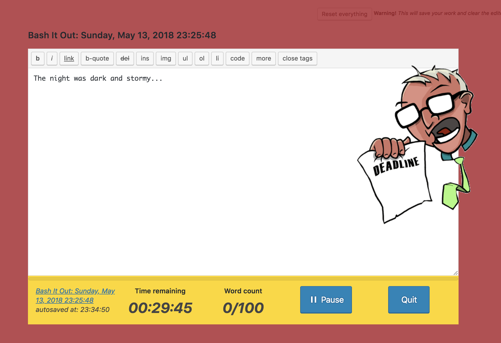
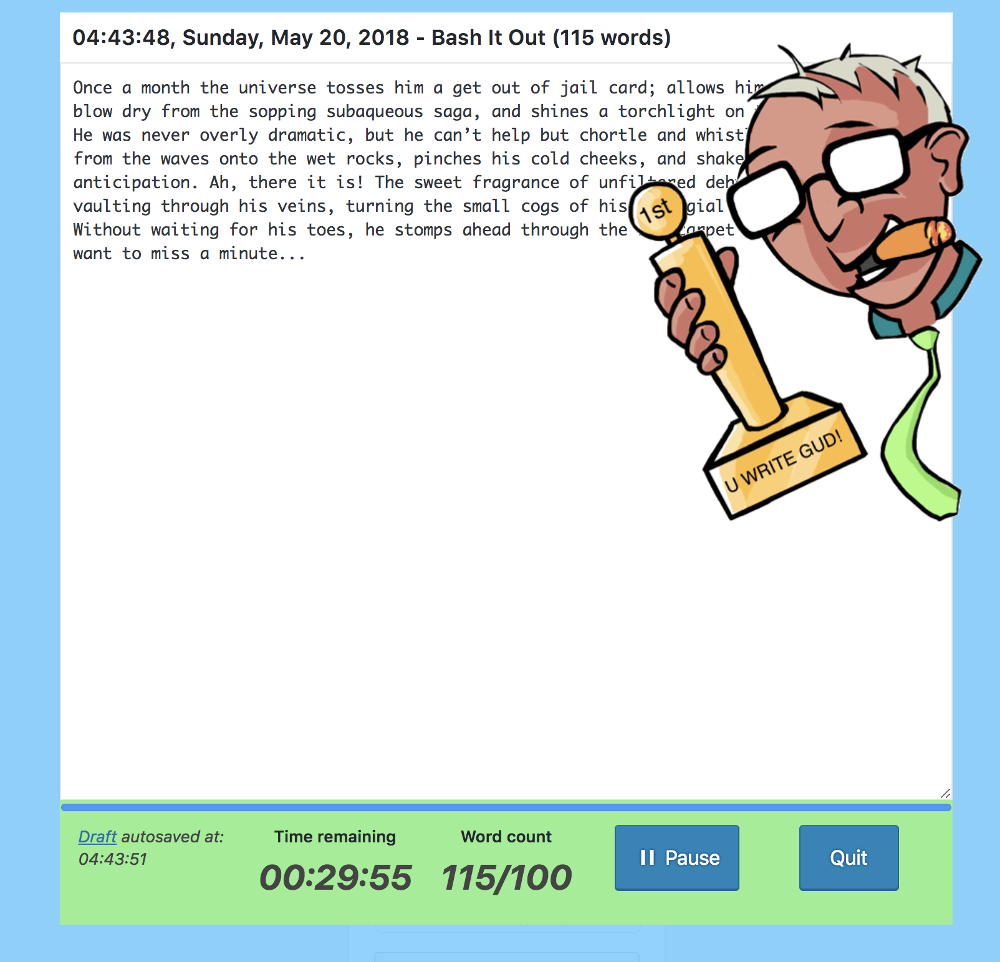
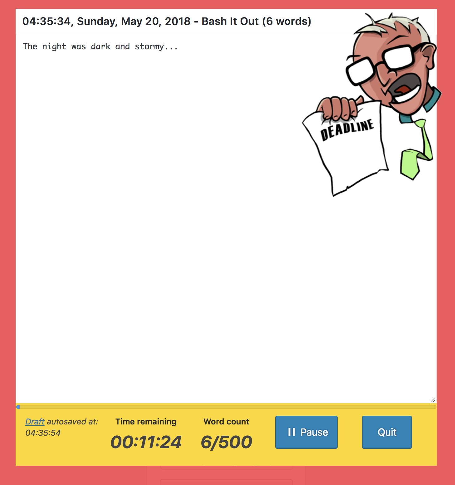

# Bash It Out

Version _1.0.0_

A simple WordPress plugin that provides the slovenly with the overbearing pressure they need to bash out that word count.

Set a word goal, writing time limit, how often you want to be nagged and then **bash it out**! Reach your word count goal before the count down! Impress your cat!

Your work is auto-saved to draft posts, which you can come back and keep bashing whenever you like.

## Changelog

[View it](CHANGELOG.md)

## TODO

- [ ] Save settings in options
- [ ] Add different styles of pressure (various art, sounds?)
- [ ] Add unit tests?

